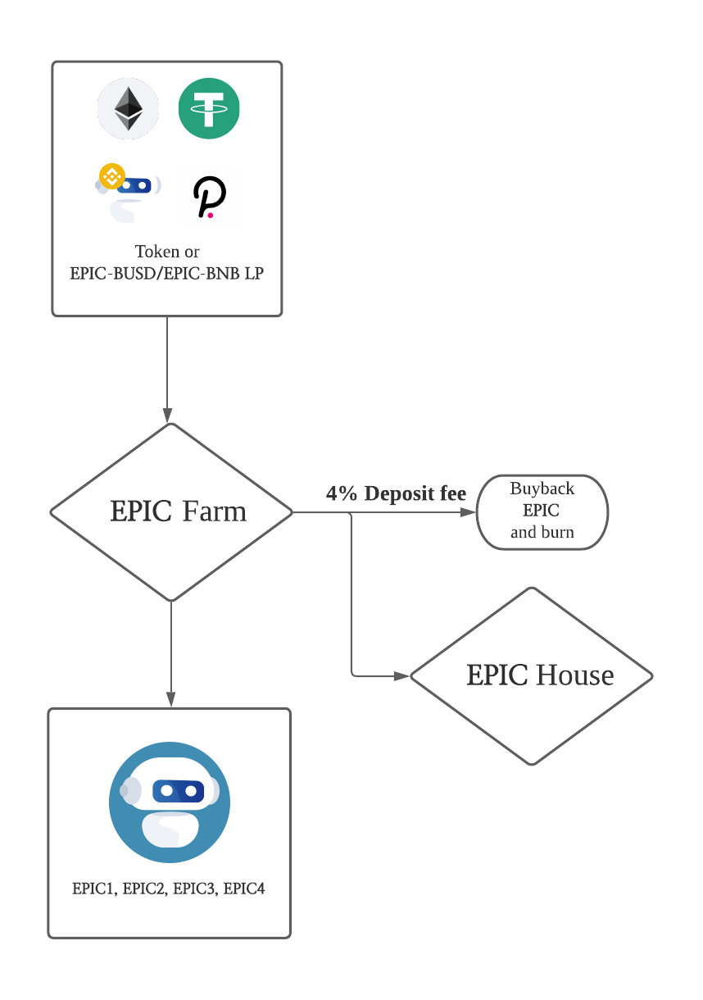

# Epic Farm

Epic farm is similar to Code/Developing where you stake EPIC-BUSD/EPIC-BNB/Tokens to generate EPIC. There will be a deposit fee of 2% on non-EPIC pools. The transaction fee will be used as follows.

* **Stake EPIC-BUSD LP to get EPIC \(0% deposit fee\)**
* **Stake EPIC-BNB LP to get EPIC \(0% deposit fee\)**
* **Stake EPIC/Tokens to get EPIC \(4% deposit fee\)**

**Deposit Fee \(2%\)**

* The Deposit fee from Epic farm will be used as follow:
  * \(1.4%\) 70% will be swapped to BUSD and injected into Epic House.
  * \(0.4%\) 20% will automatically buyback Epics and burnt
  * \(0.2%\) 10% will be sent to the developer address

